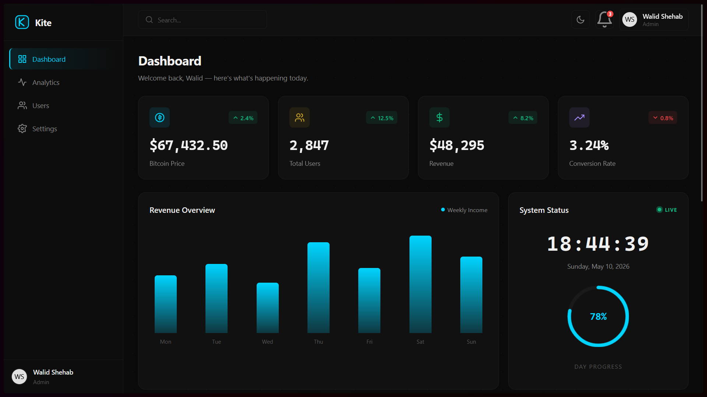

# Kite Dashboard

[](https://github.com/WalidShehab/kite-dashboard)
[](https://github.com/WalidShehab/kite-dashboard)
[](https://github.com/WalidShehab/kite-dashboard)
[](LICENSE)
[](https://github.com/WalidShehab/kite-dashboard/stargazers)

A clean analytics dashboard built with vanilla HTML, CSS, and JavaScript. No frameworks, no build step — just open the file.



---

## Features

- Live Bitcoin price via CoinDesk API
- Bar chart (revenue), line chart (traffic), donut chart (sources)
- Recent activity table with search
- User directory pulled from API with card layout
- Clock widget with day progress ring
- Dark / light theme with system preference detection
- Settings page — profile, appearance, notifications, security
- Fully responsive, sidebar collapses on mobile

---

## Usage

Download the zip from [Releases](https://github.com/WalidShehab/kite-dashboard/releases) and open `index.html` in your browser. That's it.

Or clone it:

```bash
git clone https://github.com/WalidShehab/kite-dashboard
cd kite-dashboard
```

Then open `index.html`.

No installs, no server required.

---

## Structure

```
kite-dashboard/
├── index.html
├── app.js
├── style.css
└── README.md
```

---

## License

[MIT](LICENSE)
